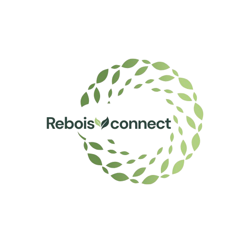
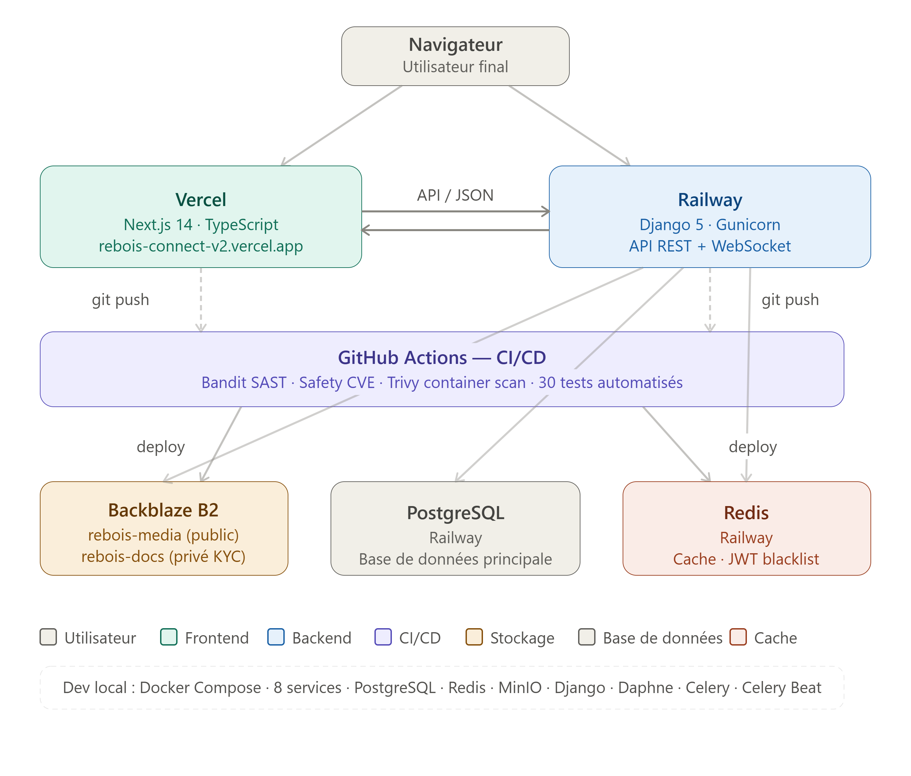

<div align="center">
  

  # Rebois Connect v2

  **La plateforme qui connecte propriétaires fonciers, mécènes et structures de reforestation pour restaurer les écosystèmes dégradés à travers le monde.**

  [](https://github.com/wlfrd18/rebois-connect-v2/actions)
  [](https://djangoproject.com)
  [](https://nextjs.org)
  [](https://python.org)
  [](https://typescriptlang.org)
  [](LICENSE)

  [🌐 Application](https://rebois-connect-v2.vercel.app) · [📖 API Docs](https://rebois-connect-v2-production.up.railway.app/api/docs/) · [🐛 Issues](https://github.com/wlfrd18/rebois-connect-v2/issues)
</div>

---

## À propos

Rebois Connect est né de l'expérience terrain de l'**ONG Teck Ivoire** (co-fondateur), pionnière du reboisement par la culture du teck en Côte d'Ivoire : 2 034 ha plantés, 14 régions, 64 départements, 204 villages.

La plateforme structure le financement de la reforestation en connectant trois acteurs :

- **Volontaires** — propriétaires fonciers qui proposent leurs terres dégradées
- **Mécènes** — investisseurs qui financent les projets et reçoivent des certificats CO₂
- **Structures** — ONG, entreprises et organismes qui réalisent les travaux sur le terrain

Chaque projet est tracé de bout en bout : soumission du terrain, validation KYC, financement en escrow, milestones vérifiés, paiements débloqués, certificats CO₂ émis.

---

## Fonctionnalités

### Workflow métier
- Soumission de terrain avec données météo temps réel (Open-Meteo API)
- Validation KYC multi-documents avec stockage privé sécurisé
- Marketplace de terrains approuvés
- Investissement en 3 étapes avec escrow et preuve de virement
- Validation de milestones avec upload de preuves géolocalisées
- Émission de certificats CO₂ (standards Verra VCS / Plan Vivo)
- Contrats PDF tripartites avec signatures et hash SHA256

### Réseau social
- Feed communautaire (Partage, Astuce, Formation, Annonce, Actualité)
- Upload d'images et vidéos dans les publications
- Likes, commentaires, follow/unfollow
- Messagerie privée entre utilisateurs
- Profils publics avec statistiques d'impact
- Liste des membres actifs avec recherche

### Sécurité DevSecOps
- JWT rotation 30 min + blacklist Redis
- Argon2 password hashing (standard OWASP 2024)
- RBAC 4 rôles avec KYC obligatoire
- Throttling anti brute-force
- Transactions atomiques ACID
- Audit trail immuable sur les flux financiers
- Pipeline CI/CD avec Bandit (SAST), Safety (CVE), Trivy (container scan)
- 30 tests automatisés (RBAC, intégrité financière, immutabilité)

---

## Architecture



### Stack technique

| Couche | Technologies |
|--------|-------------|
| **Backend** | Django 5, DRF, Django Channels, Daphne, Celery |
| **Frontend** | Next.js 14, TypeScript, Tailwind CSS, Zustand, React Query, Zod |
| **Base de données** | PostgreSQL |
| **Cache / Queue** | Redis, Celery Beat |
| **Stockage** | Backblaze B2 (2 buckets : médias publics + documents KYC privés) |
| **PDF** | WeasyPrint |
| **CI/CD** | GitHub Actions (Bandit, Safety, Trivy, pytest) |
| **Dev local** | Docker Compose (8 services) |

---

## Démarrage rapide

### Prérequis

- Docker et Docker Compose
- Node.js 18+
- Python 3.11+
- Compte Backblaze B2

### Installation locale

```bash
# Cloner le dépôt
git clone https://github.com/wlfrd18/rebois-connect-v2.git
cd rebois-connect-v2

# Configurer les variables d'environnement
cp .env.example .env
# Remplir les valeurs dans .env

# Lancer tous les services
docker compose up -d

# Créer les tables et un superutilisateur
docker compose exec backend python manage.py migrate
docker compose exec backend python manage.py createsuperuser

# Lancer le frontend
cd frontend && npm install && npm run dev
```

L'application est accessible sur `http://localhost:3000`.

### Variables d'environnement

```env
SECRET_KEY=...
DEBUG=True
ALLOWED_HOSTS=localhost,127.0.0.1
DB_NAME=rebois_connect
DB_USER=rebois_user
DB_PASSWORD=...
DB_HOST=postgres
DB_PORT=5432
REDIS_URL=redis://redis:6379/0
AWS_ACCESS_KEY_ID=...
AWS_SECRET_ACCESS_KEY=...
AWS_STORAGE_BUCKET_NAME=rebois-media
AWS_S3_ENDPOINT_URL=http://minio:9000
EMAIL_HOST_USER=...
EMAIL_HOST_PASSWORD=...
FRONTEND_URL=http://localhost:3000
```

---

## Pipeline CI/CD

Chaque push sur `main` déclenche automatiquement :

```
Push → GitHub Actions
  ├── 1. Bandit SAST      — Analyse statique du code Python
  ├── 2. Safety CVE       — Scan des dépendances vulnérables
  ├── 3. Tests Django     — 30 tests sur PostgreSQL isolé
  └── 4. Trivy            — Scan de vulnérabilités de l'image Docker
```


**Status actuel : 100% verts**

---

## Structure du projet

```
rebois-connect-v2/
├── backend/                  # Django API
│   ├── config/               # Settings, URLs, WSGI
│   ├── users/                # Auth, profils, follow, KYC
│   ├── proposals/            # Soumission et validation terrains
│   ├── contracts/            # Contrats PDF tripartites
│   ├── wallet/               # Escrow et engagements
│   ├── milestones/           # Étapes de paiement
│   ├── certificates/         # Certificats CO₂
│   ├── gamification/         # Feed social, messagerie
│   └── kyc/                  # Documents et validation KYC
├── frontend/                 # Next.js App
│   ├── app/                  # Pages (22 routes)
│   ├── components/           # Layout, composants réutilisables
│   ├── lib/                  # Client Axios, helpers
│   └── store/                # Zustand (auth)
├── .github/workflows/        # CI/CD GitHub Actions
└── docker-compose.yml        # Dev local (8 services)
```

---

## Perspectives d'évolution

### Court terme
- [ ] Celery en production (Railway service séparé)
- [ ] Notifications WebSocket temps réel en production (Daphne)
- [ ] Nom de domaine personnalisé
- [ ] Messagerie directe depuis les profils utilisateurs

### Moyen terme
- [ ] Recherche globale (terrains + utilisateurs)
- [ ] Tableau de bord analytique d'impact environnemental
- [ ] Notifications email automatiques (KYC, milestones, paiements)
- [ ] API publique documentée pour partenaires

### Long terme
- [ ] Certification CO₂ officielle Verra VCS ou Plan Vivo
- [ ] Application mobile React Native
- [ ] Intégration paiement Stripe (automatisation de l'escrow)
- [ ] Cartographie interactive des projets (Mapbox)
- [ ] Internationalisation EN / FR

---

## Contribuer

Les contributions sont les bienvenues, qu'il s'agisse de corrections de bugs, de nouvelles fonctionnalités ou d'améliorations de la documentation.

### Comment contribuer

```bash
# Forker le dépôt et cloner votre fork
git clone https://github.com/VOTRE_USERNAME/rebois-connect-v2.git

# Créer une branche pour votre contribution
git checkout -b feat/ma-fonctionnalite

# Lancer les tests avant de proposer votre PR
docker compose run --rm backend python manage.py test

# Ouvrir une Pull Request sur main
```

### Domaines où l'aide est particulièrement appréciée

- **Tests** — augmenter la couverture (tests frontend, tests API)
- **Accessibilité** — audit WCAG sur les composants frontend
- **Internationalisation** — traduction anglaise de l'interface
- **DevOps** — Helm chart Kubernetes, déploiement multi-régions
- **Sécurité** — audit de sécurité, rapport de vulnérabilité responsable

Pour toute contribution majeure, ouvrez d'abord une issue pour discuter de vos intentions.

---

## Partenaire fondateur

[**ONG Teck Ivoire**](https://www.ongteckivoire.org) — Organisation pionnière du reboisement par la culture du teck en Côte d'Ivoire, co-fondatrice de Rebois Connect.

> "La culture du teck conjugue rentabilité, écologie et reboisement." — ONG Teck Ivoire

**Impact terrain :** 2 034 ha plantés · 14 régions · 64 départements · 204 villages

---

## Auteur

**Wilfried Guele**
Étudiant en cybersécurité (Bac+3 Holberton School / École 2600) · Co-fondateur Rebois Connect

[](https://linkedin.com/in/wilfried-guele-5a456a190/)
[](https://github.com/wlfrd18)
[](https://wlfrd18.github.io)

---

## Licence

Ce projet est sous licence MIT. Voir le fichier [LICENSE](LICENSE) pour plus de détails.

---

<div align="center">
  <sub>Construit avec Django + Next.js · Déployé sur Railway + Vercel · Stockage Backblaze B2</sub><br/>
  <sub>Inspiré par l'action terrain de <a href="https://www.ongteckivoire.org">ONG Teck Ivoire</a></sub>
</div>
